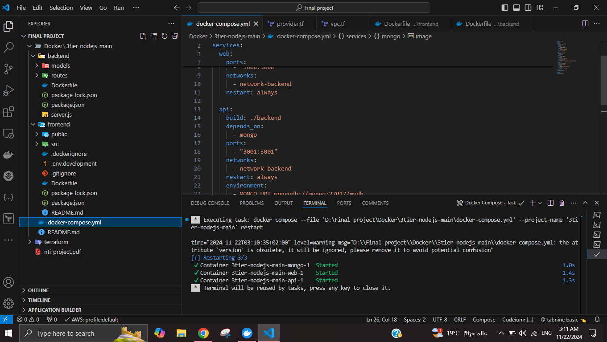

Here’s the updated **README** with the **Capture.PNG** image included for preview:

---

# **Docker Compose Setup for 3-Tier Architecture (Frontend, API, MongoDB)**

---

## **Overview**

This project demonstrates a **3-tier architecture** implemented with Docker Compose. It includes:

- **Frontend** (ReactJS)
- **Mid-tier** (API using Node.js and Express)
- **Database** (MongoDB)

In this setup:
- The **Frontend** communicates with the **Mid-tier (API)**.
- The **Mid-tier (API)** communicates with the **Database (MongoDB)**.

This architecture is built using Docker containers, where each service is isolated and can communicate with others through Docker networks.

---

## **Architecture Components**

### **1. Frontend (ReactJS)**
- **Technology**: ReactJS, built from the `node:alpine` image.
- **Purpose**: Acts as the user interface that interacts with the API.
- **Ports**: Exposes port `3000` to allow access via the browser.

### **2. Mid-Tier (API - Node.js with Express)**
- **Technology**: Node.js with Express, built from the `node:alpine` image.
- **Purpose**: Handles business logic and API requests, serves as the middle layer between the frontend and database.
- **Ports**: Exposes port `3001` for API access.

### **3. Database (MongoDB)**
- **Technology**: MongoDB, using the official `mongo:5.0` Docker image.
- **Purpose**: Stores application data. The database is persisted in a volume to ensure data is retained.
- **Ports**: Exposes port `27017` within the Docker network.

---

## **How It Works**

- **Frontend** (ReactJS) communicates with the **API** (Node.js/Express) on port `3001`.
- The **API** communicates with **MongoDB** on port `27017` within the Docker network.
  
In order to run this entire stack in Docker, you only need to run a single command:

```bash
docker-compose up
```

---

## **How to Use**

### **1. Clone the Repository**
Clone the project to your local machine:
```bash
git clone <repository-url>
cd <project-directory>
```

### **2. Initialize and Build the Containers**

Run the following command to build and start all the services defined in the `docker-compose.yml` file:

```bash
docker-compose up --build
```

This will:
- Build the **frontend** and **api** services from their respective directories (`./frontend` and `./backend`).
- Start the **frontend**, **api**, and **mongo** services, creating the necessary Docker containers.

### **3. Access the Application**

- **Frontend**: Open your browser and navigate to [http://localhost:3000](http://localhost:3000) to interact with the ReactJS interface.
- **API**: The API is accessible at [http://localhost:3001](http://localhost:3001).
- **MongoDB**: MongoDB is running on the `mongo` service and is accessible within the Docker network.

### **4. Stopping the Services**

To stop and remove the running services:

```bash
docker-compose down
```

This will stop the containers and remove them, while retaining MongoDB data stored in the `mongodb_data` volume.

---

## **Volumes**

The `mongodb_data` volume is used to persist MongoDB data. This ensures that the data will not be lost when containers are stopped or removed.

---

## **Networks**

The services are connected to the `network-backend` Docker network, enabling them to communicate securely without exposing unnecessary ports to the host machine.

---

## **Technologies Used**

- **MongoDB**: A NoSQL database used to store application data. [Learn more about MongoDB](https://www.mongodb.com/).
- **Node.js**: A JavaScript runtime for building server-side applications. [Learn more about Node.js](https://nodejs.org/).
- **Express**: A web application framework for Node.js. [Learn more about Express](http://expressjs.com/).
- **ReactJS**: A JavaScript library for building user interfaces. [Learn more about ReactJS](https://reactjs.org/).

---

## **Customizing the Setup**

You can modify the following components for your use case:
- **MongoDB URI**: Update the `MONGO_URI` environment variable in the API service to point to a custom MongoDB database.
- **Ports**: Change the ports exposed by the **frontend** or **api** services if you have conflicts with other services running locally.

---

## **Project Preview**



---

## **Cleanup**

To destroy the created resources and clean up the AWS environment:
```bash
docker-compose down
```
Provide the same variable values when prompted.

---
